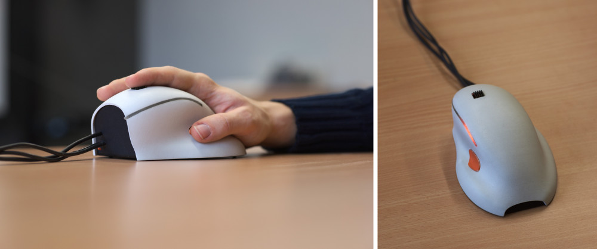
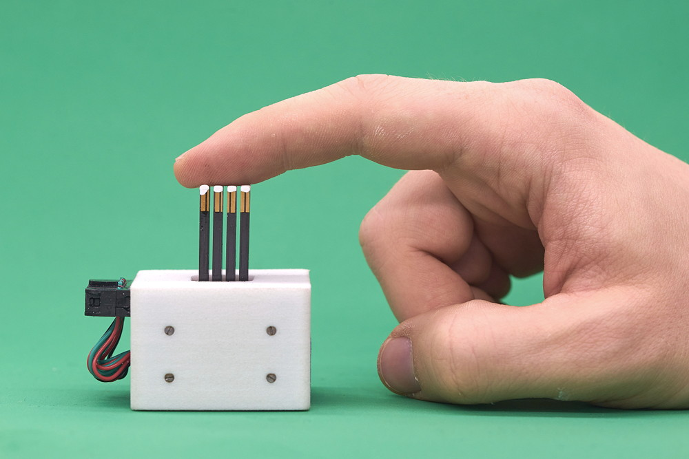
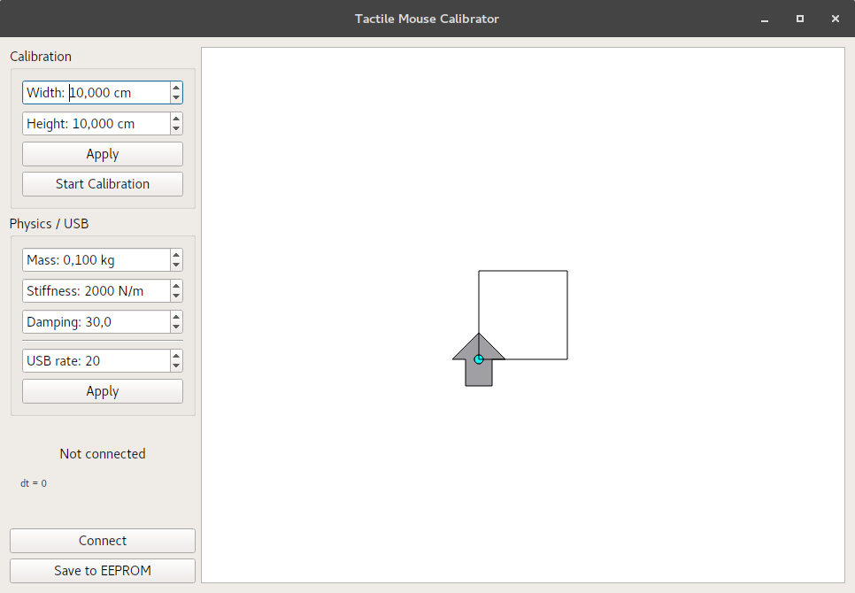

# ITCHy
The *Interactive Tactile display Control Handle*

ITCHy is a combined input/output device similar to a conventional computer mouse. It provides accurate tracking of absolute position, orientation as well as translational and angular velocities - thanks to its *two* ADNS9800 laser sensors. Using a total of 20 vibrating actuators, various tactile impressions can be transmitted to ones fingertip. Additional buttons and a RGB LED allows for basic user interaction.

ITCHy is intended to be used in conjunction with the [SCRATCHy system](https://github.com/OpenTactile/SCRATCHy).<br>
However, it can also be used in a stand-alone fashion.



### Parts needed for building the Tactile Mouse

Positional und rotational tracking is done using two *ADSN9800 Motion Sensor* boards, both connected to a *PJRC Teensy 3.2* USB Development Board via [SPI](https://en.wikipedia.org/wiki/Serial_Peripheral_Interface_Bus). By adding some buttons and a RGB LED (optional), additional user interaction is possible.

  * Teensy 3.2 USB Development Board<br>
    see, e.g. https://www.pjrc.com/store/teensy32.html    
  * Two ADNS 9800 Laser Motion Sensors<br>
    https://www.tindie.com/products/jkicklighter/adns-9800-laser-motion-sensor/
  * Flexible USB-A to Micro-USB cable of appropriate length  
  * Microswitch (as used in computer mice, e.g. [this one](http://www.newark.com/omron-electronic-components/d2f/microswitch-pin-plunger-spdt-3a/dp/36K7257)) for the thumb button
  * Tactile switch for the reset button (e.g. [this one](http://www.newark.com/alps/skhhaqa010/switch-tactile-6x6mm-vert-red/dp/94T3234))
  * (optional) RGB LED or 3 individual LEDs
  * (optional) Appropriate resistors for operating the LEDs
  
3D printable parts are located in the *tactileMouse* subfolder. For convenience, single parts have been exported to *stl* Format that should be appropriate for most manufacturers. If modifications are needed, please use [Blender](https://www.blender.org/) for editing the *tactileMouse.blend* file.

We have positive experiences with [Shapeways](https://www.shapeways.com/) for manufacturing the parts using the following materials:

  * mouse_base.stl &rarr; [Strong & Flexible Plastic](https://www.shapeways.com/materials/strong-and-flexible-plastic), Black
  * mouse_buttons.stl &rarr; [Strong & Flexible Plastic](https://www.shapeways.com/materials/strong-and-flexible-plastic), Orange Polished
  * mouse_cover.stl &rarr; [Strong & Flexible Plastic](https://www.shapeways.com/materials/strong-and-flexible-plastic), White Polished
  * mouse_diffusor.stl &rarr; [Acrylic Plastic](https://www.shapeways.com/materials/acrylic-plastic), Transparent Acrylic (Transparent Detail)

***Important: Always check dimensions of individual parts before printing!***

### Parts needed for building the tactile display

Similar to the Tactile Mouse, parts for 3D printing the tactile display are located in the folder *tactileDisplay*. Depending on the PZT actuators to be used, modifications may have to be done to the "spacer" part within the *tactileDisplay.blend* file.

If the parts are printed using Shapeways, the following materials are appropriate:

  * base.stl &rarr; [Strong & Flexible Plastic](https://www.shapeways.com/materials/strong-and-flexible-plastic), e.g. Blue Polished
  * holder.stl (optional part, not needed for operation)
  * press_merged.stl &rarr; [Steel](https://www.shapeways.com/materials/steel), e.g. Polished Nickel<br>
    To save money, both halves of the press have been merged into a single part. Please separate (and clean) the parts manually.
  * spacer.stl &rarr; [Frosted Ultra Detail](https://www.shapeways.com/materials/frosted-detail-plastic)<br>
    *Be careful, the small springs are extremely brittle!*
  * top.stl &rarr; [Strong & Flexible Plastic](https://www.shapeways.com/materials/strong-and-flexible-plastic), e.g. White Polished
  
Additional parts needed:
  * 4x Cylinderhead screw, M2.5 x 30mm
  * 4x M2.5 nut
  * Cable for connecting the actuators<br>(depending of the chosen actuator configuration, choose as flexible and light as possible)

Please have a look into the *tactileDisplay.blend* file to get an idea on how to put the parts together.
**Hint:** Applying some electrical isolation (e.g. some layers of enamel) on the top of the actuators is generally a good idea. Otherwise the driving voltage may come into direct contact with the fingertip!
This is how it should look like after assembling the parts:


### Building libITCHy
libITCHy uses the qmake build system and is available for linux platforms only. For building and installing the library system-wide, please follow these steps within the base directory:

```shell
mkdir libITCHy-build
cd libITCHy-build
qmake ../libITCHy
make && make install
```

### Building and flashing the firmware
Before the Teensy can be flashed, please install Teensyduino by following the [official instructions](https://www.pjrc.com/teensy/td_download.html). Afterwards, building and flashing the firmware is straightforward:

```shell
cd teensyHIDSimulator
make
```
If the build process was successfull, you can install the firmware by connecting the Teensy (or better say the whole Tactile Mouse) via USB and running

```shell
make upload
```
Afterwards, the RGB LED of the mouse should blink shortly in a orangish color after connecting it to USB.

### Calibrating and testing the sensors
After libITCHy has been installed, the sensors can be tested using the *ITCHyCalibration* application:

```shell
mkdir ITCHyCalibration-build
cd ITCHyCalibration-build
qmake ../ITCHyCalibration
make
./ITCHyCalibration
```



After connecting the tactile mouse and by pressing the *Connect* button, the status area on the left should show "Connected" and the current simulation timestep should be displayed.

When connecting the tactile mouse for the first time, a calibration of the sensors is needed. Please follow this procedure for proper calibration:
1. Use a (probably quite large) hard-plastic mousepad
2. Mark a distance of e.g. 10cm (or larger depending on the dimensions of the mousepad) in horizontal direction as well as in vertical direction
3. Register these distance within the GUI and click *Apply*
4. Place the tactile mouse in the bottom left of the calibration area
5. Click *Start Calibration*
6. Steadily move the device across the horizontal marker
7. Press the thumb button
8. Steadily move the device across the vertical marker
9. Press the thumb button again

After this procedure is finished, moving the mouse should show a corresponding reaction of the "arrow" in the window. You can reset orientation and position to defaults at any time by pressing the small button at the front of the device.

The ADNS sensors seem to be quite picky regarding the surface properties of the mousepad. In case no proper calibration is possible, please try another one. We made good experiences with the [Corsair MM400](http://www.corsair.com/en-ww/mm400-high-speed-gaming-mouse-pad) mousepad.

In order to save the new calibration data permanently, press the *Save to EEPROM* button.

*Additional documentation on how to tweak simulation parameters will follow*

### Using libITCHy
*More documentation will follow*

### Using the Python bindings
If you prefer to access the Tactile Mouse using Python, the ITCHPy library can be build as follows:

```shell
cd ITCHPy
make
```

To test if all dependencies are met and the whole build process was successful run
```shell
python itchpytest.py
```
within the same directory.

This file also gives some hints on how to include ITCHPy in your projects.


## API Reference

#### ICTHy
##### `void connect()`
##### `bool tryConnect()`
##### `void disconnect()`
##### `bool connected() const`

##### `bool setCalibrationParameters(const vec2f& target)`
##### `bool setSimulationParameters(float mass, float stiffness, float damping, int updateRate)`
##### `bool setColor(const color& cl)`
##### `bool startCalibration()`
##### `bool saveState()`

##### `const State& currentState(unsigned int timeout)`

##### `void addCallback(CallbackType type, const std::function<void()>& callback)`

#### TactileMouseQuery
This class implements the `PositionQuery` defined in libSCRATCHy. Please refer to the [interface documentation](https://github.com/OpenTactile/SCRATCHy#positionquery) for further details.
ITCHy supports all of the `PositionQuery` calls, such as retrieval of position, orientation, velocity, angular velocity and status of the thumb button. Using the `feedback` method, the colour of the integrated LED can be changed freely.